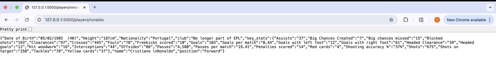
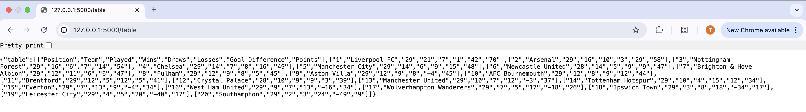
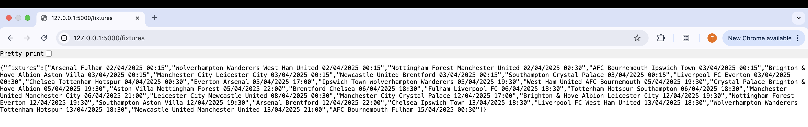

<h1>Premier League API 2.0</h1>
	
This is an unofficial Premier League API client for pulling player stats, fixtures, tables, and results data from the Premier League. The API is built using Flask, and the data is scraped from the Premier League website.

<h2>API Endpoints</h2>

The application provides the following API endpoints:

<h3>GET  /players/{player_name}</h3>

This endpoint retrieves information about a Premier League player with the given name. The player name should be provided as a URL parameter.

The API returns a JSON object with the following structure:

<pre><code>[
        {
          'name': name, 
          'position': position, 
          'club': club, 
          'Nationality': nationality, 
          'Date of Birth': dob,
          'height':height,
          'key_stats': all_stats
          }
]</code></pre>

<h3>GET /table</h3>

The JSON object contains an array of strings, where each string represents a team's position, name, number of games played, wins, draws, losses, goal difference, and total points.

The API returns a JSON object with the following structure:

<pre><code>[
      "Position",
      "Team",
      "Played",
      "Wins",
      "Draws",
      "Losses",
      "Goal Difference",
      "Points"
    ]</code></pre>

<h3>GET /fixtures/{team_name}</h3>

This endpoint retrieves information about the next Three Premier League fixtures of the team. The team name should be provided as a URL parameter.

The API returns a JSON object with the following structure:

<pre><code>[ { "Team A vs Team B DD/MM/YYYY HH:MM", "Team A vs Team C DD/MM/YYYY HH:MM", "Team A vs Team D DD/MM/YYYY HH:MM"} ] </code></pre>

<h2>Setup Details</h2>
Follow the following instructions to run the application and start using the api in your local pc
<li>Clone the repository</li>
<li>Open the terminal, navigate to the folder where your clone of this repository is located and type:
  
  `$ pip install -r requirements.txt` </li>

<li> Type $ python main.py in the terminal and the script will run for as long as you let it. </li>

<H2>Individual PLayer PL Stats</H2> 
<ul>
  <li>Example: Stats of Cristiano Ronaldo | One can use the common name of the Players as well to retrive the data</li>
     
</ul>
 <H2>Premier League Table</H2> 
<ul>
  <li>Current Premier League Table</li>
     
 </ul>
 <H2>Premier League Fixtures </H2> 
<ul>
  <li>Fixtures of the Next three weeks </li>
      
 </ul>
<H2>Update 🚀 </H2>
The API has been enhanced with new features and improvements:
<ul>
  <li>✨ Optimized the code for better performance.</li>
  <li>🔄 Rebased and updated to ensure compatibility with the latest dependencies.</li>
</ul>
You can also search player stats using the player's reference image ( Face Recognition ) as well - <a href=https://github.com/tarun7r/Premier-League-Face-Recognition>Repo</a> 📸

<H2>Disclaimer</H2>
This project is created solely for learning and educational purposes. It is not intended for production-level use or commercial applications
